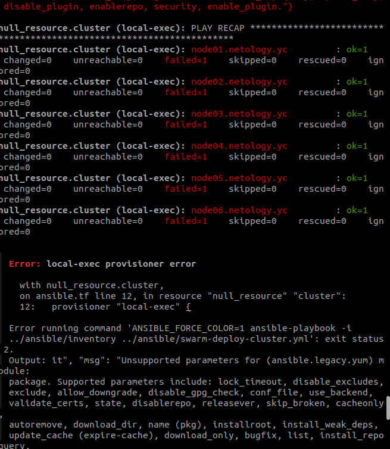

# Домашнее задание к занятию "5.5. Оркестрация кластером Docker контейнеров на примере Docker Swarm"

## Как сдавать задания

Обязательными к выполнению являются задачи без указания звездочки. Их выполнение необходимо для получения зачета и диплома о профессиональной переподготовке.

Задачи со звездочкой (*) являются дополнительными задачами и/или задачами повышенной сложности. Они не являются обязательными к выполнению, но помогут вам глубже понять тему.

Домашнее задание выполните в файле readme.md в github репозитории. В личном кабинете отправьте на проверку ссылку на .md-файл в вашем репозитории.

Любые вопросы по решению задач задавайте в чате учебной группы.

---

## Задача 1

Дайте письменые ответы на следующие вопросы:

- В чём отличие режимов работы сервисов в Docker Swarm кластере: replication и global?
- Какой алгоритм выбора лидера используется в Docker Swarm кластере?
- Что такое Overlay Network?


- replication позволяет указать точное количество экземпляров сервиса. Например, grafana на 1 ноде или nginx на 3 нодах. При этом можно указать параметры ноды: воркер или менеджер, какие-то ещё параметры. global - это режим, когда экземпляр сервиса разворачивается на всех нодах.
- Алгоритм RAFT, который позволяет найти что-то вроде "консенсуса в распределенной системе". Я посмотрела крутую визуализацию по ссылке из презентации, пересказывать очень долго, но в целом все ясно. Если нужно, перескажу.
- Это собственная сеть Docker Swarm с собственным независимым пространством DNS-имен, которая позволяет иметь leader-ноду единой точкой входа, которая управляет сетью. Внутреннее общение происходит по локальной сети. Я плохо понимаю сети, поэтому ещё глубже рассказать не могу.

## Задача 2

Создать ваш первый Docker Swarm кластер в Яндекс.Облаке

Для получения зачета, вам необходимо предоставить скриншот из терминала (консоли), с выводом команды:
```
docker node ls
```

*Начала делать и опять получила ошибку от Ansible, как и в задании 5.4. Только текста побольше:*





*Все удалила, прошу помощи.*

## Задача 3

Создать ваш первый, готовый к боевой эксплуатации кластер мониторинга, состоящий из стека микросервисов.

Для получения зачета, вам необходимо предоставить скриншот из терминала (консоли), с выводом команды:
```
docker service ls
```

## Задача 4 (*)

*Не делала*

Выполнить на лидере Docker Swarm кластера команду (указанную ниже) и дать письменное описание её функционала, что она делает и зачем она нужна:
```
# см.документацию: https://docs.docker.com/engine/swarm/swarm_manager_locking/
docker swarm update --autolock=true