# Домашнее задание к занятию "6.2. SQL"

## Введение

Перед выполнением задания вы можете ознакомиться с 
[дополнительными материалами](https://github.com/netology-code/virt-homeworks/tree/master/additional/README.md).

## Задача 1

Используя docker поднимите инстанс PostgreSQL (версию 12) c 2 volume, 
в который будут складываться данные БД и бэкапы.

Приведите получившуюся команду или docker-compose манифест.

https://github.com/Kinkreux/devops-netology/blob/master/docker-compose.yml

## Задача 2

В БД из задачи 1: 
- создайте пользователя test-admin-user и БД test_db
- в БД test_db создайте таблицу orders и clients (спeцификация таблиц ниже)
- предоставьте привилегии на все операции пользователю test-admin-user на таблицы БД test_db
- создайте пользователя test-simple-user  
- предоставьте пользователю test-simple-user права на SELECT/INSERT/UPDATE/DELETE данных таблиц БД test_db

Таблица orders:
- id (serial primary key)
- наименование (string)
- цена (integer)

Таблица clients:
- id (serial primary key)
- фамилия (string)
- страна проживания (string, index)
- заказ (foreign key orders)

Приведите:
- итоговый список БД после выполнения пунктов выше,
- описание таблиц (describe)
- SQL-запрос для выдачи списка пользователей с правами над таблицами test_db
- список пользователей с правами над таблицами test_db

Итоговый список БД:
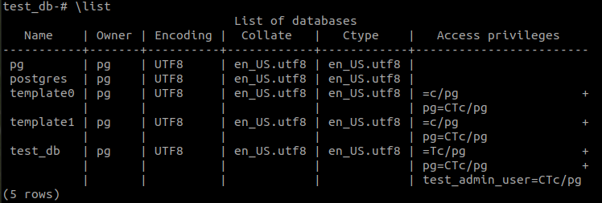

Описание таблиц:
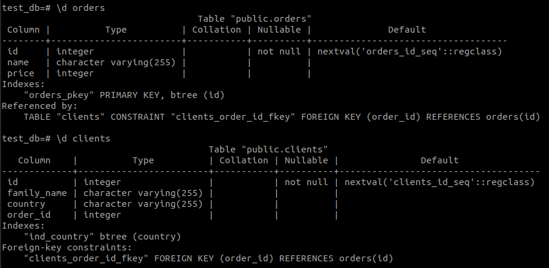

Права на таблицы:
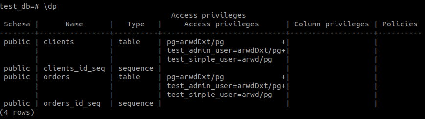

Как составить SQL-запрос на пользователей с правами, я не знаю. Пробовала лазить в системные таблицы типы pg_roles или pg_database, но ничего не вышло. Можно подсказку?

## Задача 3

Используя SQL синтаксис - наполните таблицы следующими тестовыми данными:

Таблица orders

|Наименование|цена|
|------------|----|
|Шоколад| 10 |
|Принтер| 3000 |
|Книга| 500 |
|Монитор| 7000|
|Гитара| 4000|

Таблица clients

|ФИО|Страна проживания|
|------------|----|
|Иванов Иван Иванович| USA |
|Петров Петр Петрович| Canada |
|Иоганн Себастьян Бах| Japan |
|Ронни Джеймс Дио| Russia|
|Ritchie Blackmore| Russia|

Используя SQL синтаксис:
- вычислите количество записей для каждой таблицы 
- приведите в ответе:
    - запросы 
    - результаты их выполнения.

Добавляем данные:

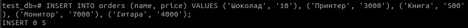

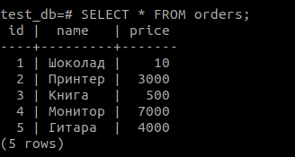

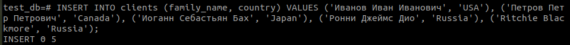

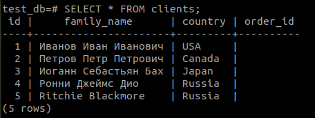

Считаем строки:

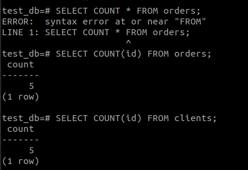

## Задача 4

Часть пользователей из таблицы clients решили оформить заказы из таблицы orders.

Используя foreign keys свяжите записи из таблиц, согласно таблице:

|ФИО|Заказ|
|------------|----|
|Иванов Иван Иванович| Книга |
|Петров Петр Петрович| Монитор |
|Иоганн Себастьян Бах| Гитара |

Приведите SQL-запросы для выполнения данных операций.

Приведите SQL-запрос для выдачи всех пользователей, которые совершили заказ, а также вывод данного запроса.
 
Подсказк - используйте директиву `UPDATE`.

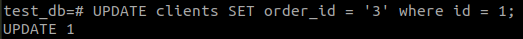

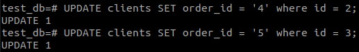

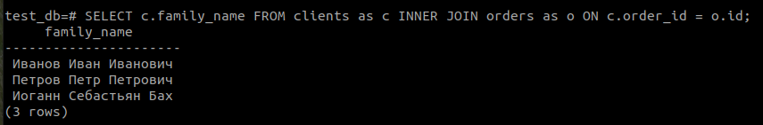

## Задача 5

Получите полную информацию по выполнению запроса выдачи всех пользователей из задачи 4 
(используя директиву EXPLAIN).

Приведите получившийся результат и объясните что значат полученные значения.

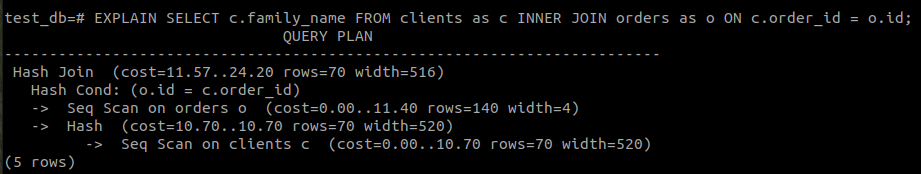

Из документации (https://www.postgresql.org/docs/14/using-explain.html) я поняла, что СУБД сделала следующее:

1. Просканировала последовательность айдишников, причем взяла именно ту таблицу, где эта последовательность указана как PRIMARY KEY;
2. Просканированные айдишники ушли на вход некоторой hash-таблице, в которой, как я поняла, производилось сравнение id и хэшей строк таблицы clients;
3. Результат работы hash-таблицы был применен на таблицу clients: из нее надо было вытащить конкретные значения для одной колонки, которая соответствовала указанным id (которые для нее являются Foreign Key).

## Задача 6

Создайте бэкап БД test_db и поместите его в volume, предназначенный для бэкапов (см. Задачу 1).

Остановите контейнер с PostgreSQL (но не удаляйте volumes).

Поднимите новый пустой контейнер с PostgreSQL.

Восстановите БД test_db в новом контейнере.

Приведите список операций, который вы применяли для бэкапа данных и восстановления.


*Я так и не поняла, как мне создать пустой контейнер с postgres с теми же параметрами и в той же директории, если это изначально не было прописано в docker-compose файле. scale не получился, потому что в файле явно заданы порты и 2 инстанса их не могут поделить. Поэтому я подняла просто docker-контейнер, в котором не было нового пользователя pg, и восстановление из бэкапа прошло условно нормально. На самом деле, задним умом понимаю, что можно было вручную создать такого пользователя и дать ему права, а потом уже запускать бэкап. Наверно, поэтому же не создались новые пользователи (хотя я смотрела внутрь дампа и не помню, была ли там информация про пользователей - ведь я делала дамп именно базы, а не снимок всей СУБД). Так или иначе, список команд привожу, включая вывод команды, которая восстановила БД из бэкапа.*

```
## делаем дамп базы из-под root
pg_dump -U pg -f test_db > /dump/test_db.backup

## запускаем контейнер с пустым postgres
docker run --name empty-postgres -e POSTGRES_PASSWORD=pass -d postgres:12

```

Дальше происходили розыски, где лежит volume  с бэкапом. Нашелся.

```
## создаем в новом контейнере из-под root папку /dump/, потому что ее там нет, а пусть будет
mkdir /dump

## копируем файл с бэкапом в контейнер с postgres прямо наживую
sudo docker cp /var/lib/docker/volumes/devops-netology_backup/_data/test_db.backup empty-postgres:/dump/test_db.backup

## восстанавливаем бд из бэкапа
psql -U postgres -f /dump/test_db.backup

```

Вот результат:

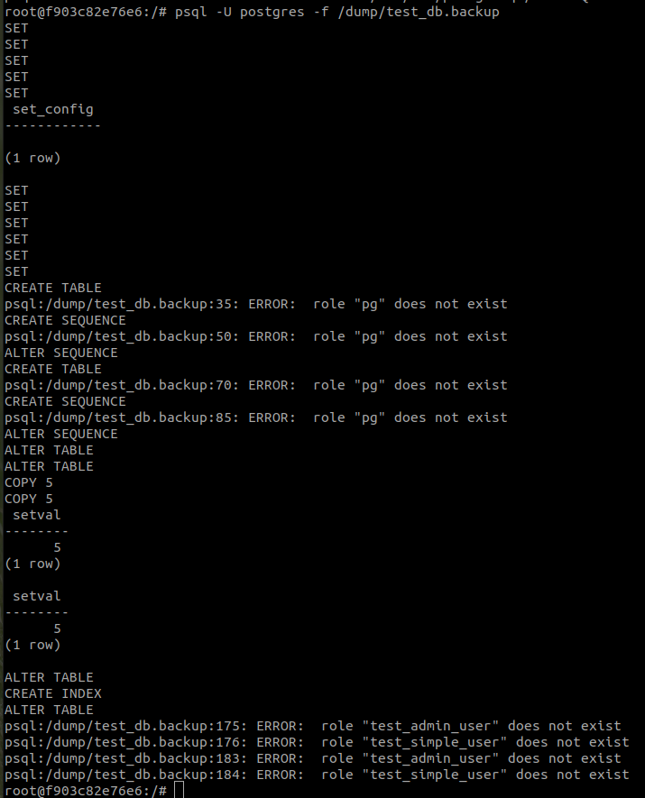