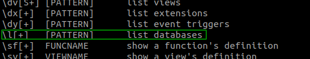

# Домашнее задание к занятию "6.4. PostgreSQL"

## Задача 1

Используя docker поднимите инстанс PostgreSQL (версию 13). Данные БД сохраните в volume.

Подключитесь к БД PostgreSQL используя `psql`.

Воспользуйтесь командой `\?` для вывода подсказки по имеющимся в `psql` управляющим командам.

**Найдите и приведите** управляющие команды для:
- вывода списка БД
- подключения к БД
- вывода списка таблиц
- вывода описания содержимого таблиц
- выхода из psql

Вывод списка БД:

``` \l```



Подключение к БД:

``` \connect (or \c) [ dbname [ username ] ] ```


Вывод списка таблиц:

``` \dt```


Вывод описания содержимого таблиц:

``` \d my_table```


выход из psql:

```\q ```


Вообще, документация рулит https://www.postgresql.org/docs/8.0/app-psql.html

## Задача 2

Используя `psql` создайте БД `test_database`.

Изучите [бэкап БД](https://github.com/netology-code/virt-homeworks/tree/master/06-db-04-postgresql/test_data).

Восстановите бэкап БД в `test_database`.

Перейдите в управляющую консоль `psql` внутри контейнера.

Подключитесь к восстановленной БД и проведите операцию ANALYZE для сбора статистики по таблице.

Используя таблицу [pg_stats](https://postgrespro.ru/docs/postgresql/12/view-pg-stats), найдите столбец таблицы `orders` 
с наибольшим средним значением размера элементов в байтах.

**Приведите в ответе** команду, которую вы использовали для вычисления и полученный результат.


## Задача 3

Архитектор и администратор БД выяснили, что ваша таблица orders разрослась до невиданных размеров и
поиск по ней занимает долгое время. Вам, как успешному выпускнику курсов DevOps в нетологии предложили
провести разбиение таблицы на 2 (шардировать на orders_1 - price>499 и orders_2 - price<=499).

Предложите SQL-транзакцию для проведения данной операции.

Можно ли было изначально исключить "ручное" разбиение при проектировании таблицы orders?

1. Создаем 2 таблицы, которые наследуют предыдущей:

``` 
CREATE TABLE orders_1 (
  CHECK ( price > 499 )
  ) INHERITS (order)

CREATE TABLE orders_1 (
  CHECK ( price <= 499 )
  ) INHERITS (order)

2. Добавляем в изначальную таблицу такие правила:
3. 
CREATE RULE Щorders_insert_to_1 AS ON INSERT TO orders
WHERE ( price > 499 )
DO INSTEAD INSERT INTO orders_1 VALUES (NEW.*)

CREATE RULE Щorders_insert_to_2 AS ON INSERT TO orders
WHERE ( price <= 499 )
DO INSTEAD INSERT INTO orders_2 VALUES (NEW.*)
```

Потом, наверно, ещё полезно будет создать индекс по колонке "price", чтобы поиск проходил быстрее. Возможно, даже кластерный.

По условию задачи неясно, требуется ли шардирование в пределах одной базы или разделение таблицы по разным базам. Мое сработает на одной базе, для разных синтаксис наверняка будет сложнее - надо ведь указать все базы. А принцип будет тот же.

Что касается вопроса про проектирование сразу с прицелом на шардирование: да, такое в PostgreSQL есть. Есть настройка количества шардов "shards=" (например, 2 или 16). Она будем автоматически делать базу на шарды, если я правильно понимаю. Но в интернетах пишут, что так лучше не делать, потому что такие меры лучше не принимать заранее. Иначе потом будет только сложнее понять, откуда идут проблемы. Ещё можно сесть и подумать над схемой данных, чтобы таблица orders, которая первый кандидат в гиганты (после users), не была такой гигантской. Может, мы можем сразу поделить orders на несколько разных таблиц, особенно если заказы качественно отличаются и по-разному обрабатываются. Может, мы вообще хотим документо-ориентированную БД под заказы типа Mongo, и это тоже поможет избежать мануального шардирования в будущем, Mongo само с ним справится. : )

## Задача 4

Используя утилиту `pg_dump` создайте бекап БД `test_database`.

Как бы вы доработали бэкап-файл, чтобы добавить уникальность значения столбца `title` для таблиц `test_database`?

Бэкап сделала, а вопрос про уникальность значения столбца title не поняла. : ( Что с ним именно не так?