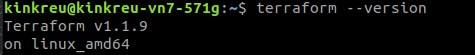

# Домашнее задание к занятию "7.1. Инфраструктура как код"

## Задача 1. Выбор инструментов. 
 
### Легенда
 
Через час совещание на котором менеджер расскажет о новом проекте. Начать работу над которым надо 
будет уже сегодня. 
На данный момент известно, что это будет сервис, который ваша компания будет предоставлять внешним заказчикам.
Первое время, скорее всего, будет один внешний клиент, со временем внешних клиентов станет больше.

Так же по разговорам в компании есть вероятность, что техническое задание еще не четкое, что приведет к большому
количеству небольших релизов, тестирований интеграций, откатов, доработок, то есть скучно не будет.  
   
Вам, как девопс инженеру, будет необходимо принять решение об инструментах для организации инфраструктуры.
На данный момент в вашей компании уже используются следующие инструменты: 
- остатки Сloud Formation, 
- некоторые образы сделаны при помощи Packer,
- год назад начали активно использовать Terraform, 
- разработчики привыкли использовать Docker, 
- уже есть большая база Kubernetes конфигураций, 
- для автоматизации процессов используется Teamcity, 
- также есть совсем немного Ansible скриптов, 
- и ряд bash скриптов для упрощения рутинных задач.  

Для этого в рамках совещания надо будет выяснить подробности о проекте, что бы в итоге определиться с инструментами:

1. Какой тип инфраструктуры будем использовать для этого проекта: изменяемый или не изменяемый?
1. Будет ли центральный сервер для управления инфраструктурой?
1. Будут ли агенты на серверах?
1. Будут ли использованы средства для управления конфигурацией или инициализации ресурсов? 
 
В связи с тем, что проект стартует уже сегодня, в рамках совещания надо будет определиться со всеми этими вопросами.

### В результате задачи необходимо

1. Ответить на четыре вопроса представленных в разделе "Легенда". 
1. Какие инструменты из уже используемых вы хотели бы использовать для нового проекта? 
1. Хотите ли рассмотреть возможность внедрения новых инструментов для этого проекта? 

Если для ответа на эти вопросы недостаточно информации, то напишите какие моменты уточните на совещании.

*Ответ*

1. **Какой тип инфраструктуры будем использовать для этого проекта: изменяемый или не изменяемый?** Чтобы не запутаться в большом количестве мелких изменений, иметь возможность легко вернуться к любой минорной версии и легко тестировать, будем использовать неизменяемую структуру.
2. **Будет ли центральный сервер для управления инфраструктурой?** Я почитала про Teamcity и да, там центральный сервер есть. Так что будет центральный сервер Teamcity. Плюс, скорее всего, центральный сервер есть у Nexus. Также с помощью того же Teamcity и той системы управления версиями, которая уже используется (какой-то git точно уже есть, без него бы не полетело все остальное) будут храниться все конфигурации IaC.
3. **Будут ли агенты на серверах?** Да, у Teamcity есть агенты, поэтому будут. Возможно, они же есть у Nexus (не знаю точно).
4. **Будут ли использованы средства для управления конфигурацией или инициализации ресурсов?** Я бы остановилась максимально на инициализации ресурсов: terraform + Docker. Docker по сути тоже является системой инициализации ресурсов. Это позволит легко и быстро танцевать между сборками (и, кстати, сранивать их в коде).
5. **Какие инструменты из уже используемых вы хотели бы использовать для нового проекта?** Для поддержки неизменяемой инфраструктуры будем опираться на  Опираться будем на Packer, Terraform, Teamcity. Для обеспечения быстроты, масштабируемости всего цикла разработки - Docker и Kubernetes в связке с тремя уже перечисленными инструментами.
6. **Хотите ли рассмотреть возможность внедрения новых инструментов для этого проекта?** Для хранения, версионирования и запуска сборок я бы задействовала Nexus в связке с Teamcity и прочим перечисленным софтом. (отчасти потому, что других хранилищ я толком не знаю, а Nexus - точно рабочее и масштабируемое решение)
7. **Если для ответа на эти вопросы недостаточно информации, то напишите какие моменты уточните на совещании.** Я бы уточнила стек разработки, контекст использования (на какие устройства мы будем делать софт, как тестировать - могут понадобиться физические машины для тестирования). Также я бы уточнила планируемые условия поставки услуги клиентам, чтобы понять, сможем ли мы в бою использовать тот же pipeline, что и для разработки и тестирования. Ещё надо понимать количество и организацию команд разработчиков (скажем, если есть подрядчики, могут быть проблемы с интеграцией их в общий pipeline из-за того, что у них собственные внутренние процессы).

## Задача 2. Установка терраформ. 

Официальный сайт: https://www.terraform.io/

Установите терраформ при помощи менеджера пакетов используемого в вашей операционной системе.
В виде результата этой задачи приложите вывод команды `terraform --version`.

## Задача 3. Поддержка легаси кода. 

В какой-то момент вы обновили терраформ до новой версии, например с 0.12 до 0.13. 
А код одного из проектов настолько устарел, что не может работать с версией 0.13. 
В связи с этим необходимо сделать так, чтобы вы могли одновременно использовать последнюю версию терраформа установленную при помощи
штатного менеджера пакетов и устаревшую версию 0.12. 

В виде результата этой задачи приложите вывод `--version` двух версий терраформа доступных на вашем компьютере 
или виртуальной машине.

*Попробовала tfenv и запуталась*